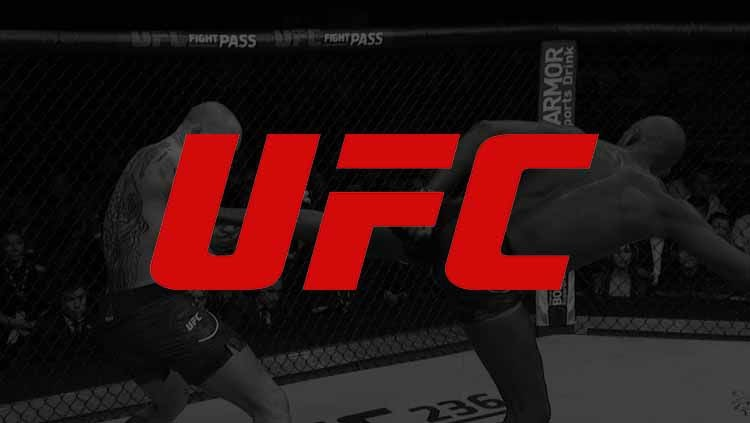

# Final Project: UFC Fight Prediction Model

# Communication Protocols
As a collective we decided that the Square Role (Git Hub & Presentation) was going to be headed by Cade, the Triangle Role (Machine Learning) was going to be led by Joey, the Circle Role (Database) was going to be managed by Charles, and The X Role (Dashboard Design) was going to be guided by Kohle. With these distinct roles in place, our team has an outline of who is in charge of what. However, our group intends on working together amoungst all necesary duties by utilizing the team's slack group chat for live communication and delgation.

# Project Background

## Topic Selection
As a group we decided to center our project around predicting the outcome of a given UFC fight, based on the statistics we deem most correlated to the final restult. We selected this topic for the reasoning that we are all fans of mixed martial arts, while at the same time being interested in the determining factors of a fight. We came to the conclusion that we would be able to transform and visualize data on this topic to answer interesting and significant questions.

## Focus Questions
1. How Does Age Correlate With Fighter Success?
2. Does Damage Have A Cumulative Effect?
3. How Does Height/Reach Impact A Fight?
4. Where Are The Best Fighters Located?
5. Which Are The Best Fight Camps?

## Technologies Used
* Excel
* Excel VBA
* Python
* SQL
* PG Admin
* Machine Learning
* Neural Link
* Tableau
* Git Hub

# Data Process

## Data Sources
 We found two expansive data sets on kaggle.com that provided sigificant statistics of every UFC fight from 1993 to 2021. These statistics include fight outcomes, in-fight damage, fighter attributes, and fighter locations. Our goal with this project is to utilize these data sets to determine if a UFC fight can be predicted, to a degree, based on certain statistics. Also, we hope to answer our focus questions with this raw data.

## Data Cleaning
For the cleaning portion of our data, we took our two raw data sources and utilized machine learning to find the highest correlated stats to victory. With these results we were able to condense our data set into our own database which yielded the most accurate model. Now our model is optimized, unnecessary data is elimitated, and we have a clear course to answering our focus questions

## Data Exploration
Our direction in the data exploration phase was to utilize machine learning to solve our main question of can fights be predicted, is damage cumulative, and how does height and reach impact a fight. On the otherhand we used tablaeu to slove peak age, best fight camps, and where are the origins of the best fighters. This road map gave us the path we needed to test our questions with our refined data.

# Data Analysis

## Machine Learning
I combined all the fighters into one data set with their stats aligned correctly (All_Fighters_aligned, 11/23 now "Fighters_Camps_aligned") so I could begin machine testing. There are also seperate data sets for Red Fighters, Blue Fighters, as well as another set seperating just winners and losers. There are two sets of Machine learning models that I built to get us started. I used the complete data set to run a decisiosn tree model and a randomforest model. They both performed better than expected. With the randomforest model I was able to generate a list of fields that have the heaviset impact on our predicitons. This will help us pick features that will give us the most improved results. Next step will be to run the same model with our modified data that we chose and then again with the "important" features generated by the machine learning importance report. 

11/23 Update: 

SQL is being used to take in the data and create a AWS from the the data. Data being analyzed by members to try to break data down to be more manageable.

### Decision Tree

### RandomForest

### RandomForest with gradient boosting

## Dashboard Results

# Google Slides & Resources
https://docs.google.com/presentation/d/1-Cx8XTGV_2w4LcIt0c1MozEyiDVF2S2qxdrdHueo9KY/edit#slide=id.p  
https://www.kaggle.com/datasets/binduvr/pro-mma-fighters  
https://www.kaggle.com/datasets/rajeevw/ufcdata
